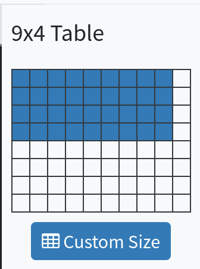
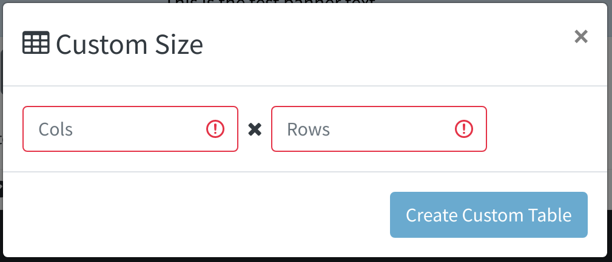
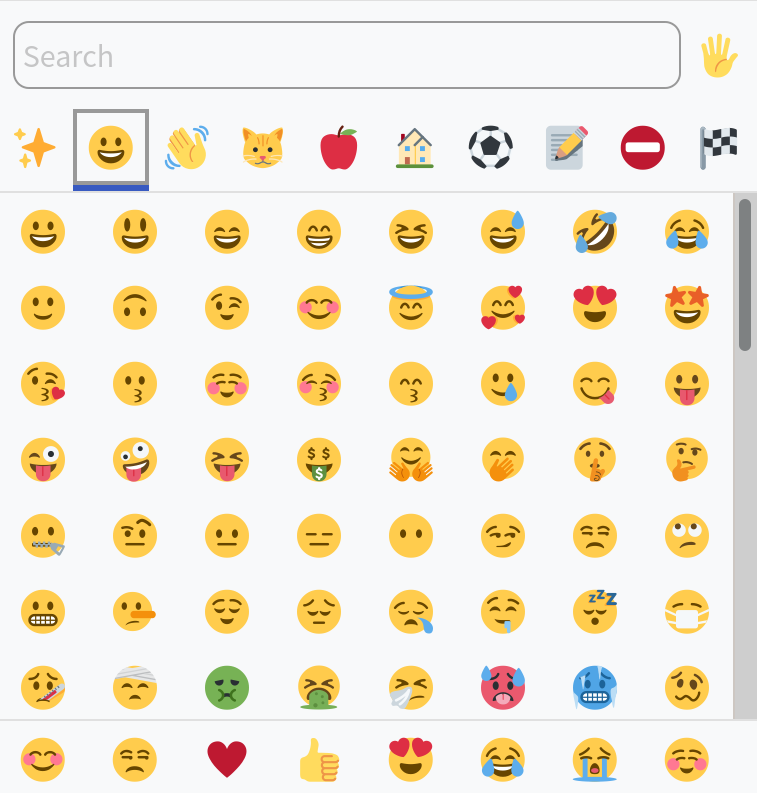

# Toolbar


The Toolbar is found above the editor and is split into five sections:

1. Emphasis
2. Header & Blocks
3. Links & Images
4. Larger Blocks & Emojis
5. Settings

## Emphasis


These buttons are able to either surround selected text with the necessary symbols to emphasize it or insert the symbols
without any content between them to be filled out by you. The icons on the buttons should be rather easy to identify.
Nonetheless, here is their functionality:

1. bold e.g `**text**`
2. italic e.g `*text*`
3. underscore e.g `_text_`
4. strikethrough e.g `~~text~~`
5. subscript e.g `~text~`
6. superscript e.g `^text^`

## Header & Blocks


These buttons all work a bit different so, we will describe each on separately:

1. **Heading**  
   Adds `# ` in front of the line. If the line is already starting with a `#` adds just `#`.
2. **Code Blocks**  
   Adds ` ``` ` around the selected text or if no text is selected just adds two lines with ` ``` ` and an empty line
   between them.
3. **Quote**  
   Adds `> ` in front of the line.
4. **Unordered List**  
   Ads `- ` in front of the line.
5. **Ordered List**  
   Adds `1. ` in front of the line.
6. **ToDo List**  
   Adds `- [ ] ` in front of the line.

## Links & Images


These buttons add the corresponding syntax at the current cursor position.
If some text is selected it will either put that as the link, if it thinks that the selected text is a link, or as the alt text.

1. **Link**  
   Adds the link template `[](https://)` (For more information
   see [the markdown link documentation](https://spec.commonmark.org/0.29/#links))
2. **Image**  
   Adds the image placeholder `` (For more information
   see [the markdown image documentation](https://spec.commonmark.org/0.29/#images))
3. **Image Upload**  
   Asks the user to upload an image from their computer and then inserts it in the note.

## Larger Blocks & Emojis


1. **Table**  
   This button opens an overlay, which lets you choose the size of your table up to 10 columns and 8 rows. By clicking
   on any of the squares a table with the corresponding size will be added to the note at the position of your cursor.  
     
   A larger table can be created by clicking the 'Custom Size' button.  
     
   In the modal you can specify the exact dimension of your table.
2. **Horizontal Line**  
   This button adds `---` at the current position of your cursor in the note.
3. **Collapsable Block**  
   This button adds a template for a Collapsable Block like this:

     ```
     :::spoiler Toggle label
     Toggled content
     :::
     ```

4. **Comment**  
   This button adds `> []` at the beginning of the line. You can either specify a name for your comment by
   inserting `name=$YourName`, a time by inserting `time=$time` or a color by inserting `color=#FFFFFF` in the `[]`.
   Please note that you can only specify one of those per `[]`, but you can use multiple `[]`.
5. **Emoji Picker**  
   This button opens the emoji picker, where you can choose an emoji or a fork awesome icon to insert into your note.  
   

## Settings

ToDo
